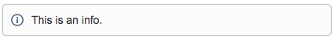
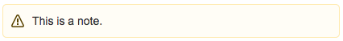

# Markdown to Confluence Converter

This tool can be used to import markdown documents into Confluence.  It is a fork of [RittmanMead/md_to_conf](https://github.com/RittmanMead/md_to_conf), upgraded to Python 3.11 and the Confluence v2 APIs.

The file is converted to HTML and uploaded to Confluence using their `storage` representation.  The following functionality is supported:

1. Inline images
2. Code blocks
3. Some custom markdown tags


## Requirements

* Python 3.11+
* PIP

## Installation

You can install this tool using `pip`:

```bash
pip install md-to-conf
```

It is recommended that your run this in a [virtual environment](#python-virtual-environment) to ensure package compatibility.

### Python Virtual Environment

The project code and dependencies can be used based on python virtualenv.

Create a new python virtualenv and activate it:

```less
python3 -m venv venv
source venv/bin/activate
```

Or in **Anaconda**

```bash
  conda create --name md_to_conf python=3.11 --yes
  conda activate md_to_conf
```

Install `md-to-conf`


```bash
  pip install md-to-conf
```

Type `md-to-conf --help` for details, or see the [Usage](#usage) section below.


### Dependencies

Required python dependencies can be installed using:

```less
pip3 install -r requirements.txt
```

## Usage

### Basic

The minimum accepted parameters are the markdown file to upload as well as the Confluence space key you wish to upload to. For the following examples assume 'Test Space' with key: `TST`.

```less
python3 md2conf.py readme.md TST
```

Mandatory Confluence parameters can also be set here if not already set as [environment variables](#environment-variables):

* **-u** **--username**: Confluence User
* **-p** **--apikey**: Confluence API Key
* **-o** **--orgname**: Confluence Organization

```less
python3 md2conf.py readme.md TST -u basil -p abc123 -o fawltytowers
```

Use **-h** to view a list of all available options.

### Environment Variables

To use it, you will need your Confluence username, API key and organization name.
To generate an API key go to [https://id.atlassian.com/manage/api-tokens](https://id.atlassian.com/manage/api-tokens).

You will also need the organization name that is used in the subdomain.
For example the URL: `https://fawltytowers.atlassian.net/wiki/` would indicate an organization name of **fawltytowers**.

If the organization name contains a dot, it will be considered as a Fully Qualified Domain Name.
For example the URL: `https://fawltytowers.mydomain.com/` would indicate an organization name of **fawltytowers.mydomain.com**.

These can be specified at runtime or set as Confluence environment variables
(e.g. add to your `~/.profile` or `~/.bash_profile` on Mac OS):

``` bash
export CONFLUENCE_USERNAME='basil'
export CONFLUENCE_API_KEY='abc123'
export CONFLUENCE_ORGNAME='fawltytowers'
```

On Windows, this can be set via system properties.

### Other Uses

Use **-a** or **--ancestor** to designate the name of a page which the page should be created under.

```less
python md2conf.py readme.md TST -a "Parent Page Name"
```

Use **-d** or **--delete** to delete the page instead of create it. Obviously this won't work if it doesn't already exist.

Use **-n** or **--nossl** to specify a non-SSL url, i.e. **<http://>** instead of **<https://>**.

Use **-l** or **--loglevel** to specify a different logging level, i.e **DEBUG**.

Use **-s** or **--simulate** to stop processing before interacting with confluence API, i.e. only
 converting the markdown document to confluence format.

Use **--title** to set the title for the page, otherwise the title is going to be the first line in the markdown file

Use **--remove-emojies** to emove emojies if there are any. This may be need if the database doesn't support emojies

## Markdown

The original markdown to HTML conversion is performed by the Python **markdown** library.
Additionally, the page name is taken from the first line of  the markdown file, usually assumed to be the title.
In the case of this document, the page would be called: **Markdown to Confluence Converter**.

Standard markdown syntax for images and code blocks will be automatically converted.
The images are uploaded as attachments and the references updated in the HTML.
The code blocks will be converted to the Confluence Code Block macro and also supports syntax highlighting.

### Doctoc

If present, what is between the [doctoc](https://github.com/thlorenz/doctoc) anchor format:

```less
<!-- START doctoc ...
...
... END doctoc -->
```

will be replaced by confluence "toc" macro leading to something like:

```html
<h2>Table of Content</h2>
<p>
    <ac:structured-macro ac:name="toc">
      <ac:parameter ac:name="printable">true</ac:parameter>
      <ac:parameter ac:name="style">disc</ac:parameter>
      <ac:parameter ac:name="maxLevel">7</ac:parameter>
      <ac:parameter ac:name="minLevel">1</ac:parameter>
      <ac:parameter ac:name="type">list</ac:parameter>
      <ac:parameter ac:name="outline">clear</ac:parameter>
      <ac:parameter ac:name="include">.*</ac:parameter>
    </ac:structured-macro>
    </p>
```

### Information, Note and Warning Macros

> **Warning:** Any blockquotes used will implement an information macro. This could potentially harm your formatting.

Block quotes in Markdown are rendered as information macros.

```less
> This is an info
```



```less
> Note: This is a note
```



```less
> Warning: This is a warning
```


Alternatively, using a custom Markdown syntax also works:

```less
~?This is an info.?~

~!This is a note.!~

~%This is a warning.%~
```

## Miscellaneous

```less
    ╚⊙ ⊙╝
  ╚═(███)═╝
 ╚═(███)═╝
╚═(███)═╝
 ╚═(███)═╝
  ╚═(███)═╝
   ╚═(███)═╝
```
